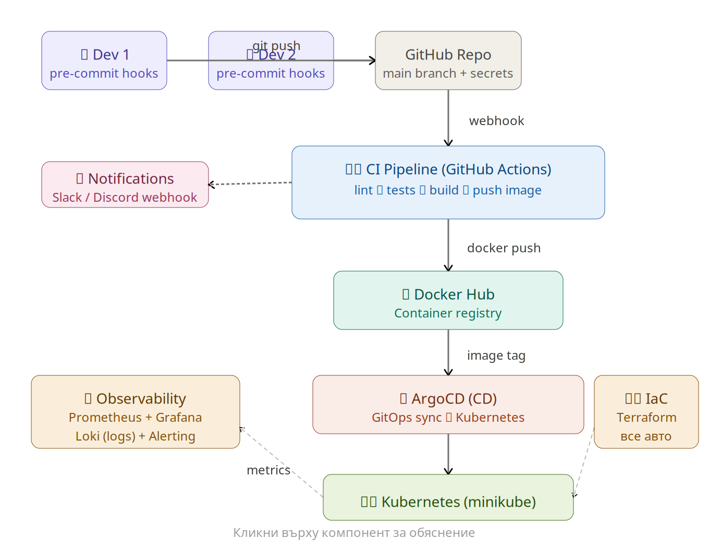

# DevOps Todo App

Уеб базирано Todo приложение, демонстриращо пълен CI/CD pipeline с Kubernetes оркестрация, Infrastructure as Code и observability stack.

## Какъв проблем решава

Проектът показва end-to-end DevOps практика: от локален код през автоматизирано тестване, билдване на Docker имидж, публикуване в Docker Hub, GitOps деплой с ArgoCD към Kubernetes клъстер, до мониторинг и алертинг. Приложението само по себе си е прост Flask REST API за управление на задачи (tasks).

## Архитектурна диаграма



Високо ниво на flow-а:

```
Developer -> Git push -> GitHub -> GitHub Actions (lint + pytest)
                                -> Docker build -> Docker Hub
ArgoCD  <- watches repo  <- k8s/ manifests
ArgoCD  -> kubectl apply -> Kubernetes (minikube)
Prometheus/Grafana/Loki scrape metrics + logs -> Alertmanager -> Discord webhook
```

## Технологии

| Технология | Версия | Цел |
|---|---|---|
| Python / Flask | 3.11 / 3.0 | Web приложение |
| prometheus-flask-exporter | 0.23 | Експорт на метрики |
| Docker | 24.x | Контейнеризация |
| Kubernetes (minikube) | 1.28+ | Оркестрация |
| GitHub Actions | - | CI Pipeline |
| ArgoCD | 2.9 | CD (GitOps) |
| Terraform | >= 1.6 | Infrastructure as Code |
| Prometheus + Grafana | kube-prometheus-stack | Метрики и дашбордове |
| Loki | 2.9 | Агрегиране на логове |
| Alertmanager | - | Алерти към Discord |
| pre-commit + gitleaks | 3.6 / 8.18 | Сигурност при коммит |

## Стартиране

### Локално с Python

```bash
pip install -r app/requirements.txt
python app/app.py
# -> http://localhost:5000/health
```

### С Docker

```bash
docker build -t devops-app .
docker run -p 5000:5000 devops-app
```

### С Kubernetes (minikube)

```bash
minikube start --cpus=4 --memory=4096
kubectl apply -f k8s/deployment.yaml
kubectl apply -f k8s/service.yaml
minikube service devops-app-service
```

### С Terraform (IaC)

```bash
cd terraform
terraform init
terraform apply -auto-approve
```

### ArgoCD (GitOps CD)

```bash
kubectl create namespace argocd
kubectl apply -n argocd -f https://raw.githubusercontent.com/argoproj/argo-cd/stable/manifests/install.yaml
kubectl apply -f k8s/argocd-app.yaml
```

### Monitoring stack

```bash
bash monitoring/install.sh
# Grafana -> minikube service -n monitoring monitoring-grafana
```

## API endpoints

| Метод | Път | Описание |
|---|---|---|
| GET | `/health` | Health check |
| GET | `/tasks` | Списък със задачи |
| POST | `/tasks` | Добавя задача `{"title": "..."}` |
| DELETE | `/tasks/<id>` | Изтрива задача |
| GET | `/metrics` | Prometheus метрики |

## Структура на проекта

```
vot_proekt/
├── app/                    # Flask приложение
│   ├── app.py              # REST API
│   └── requirements.txt
├── tests/                  # Pytest тестове
│   └── test_app.py
├── k8s/                    # Kubernetes манифести
│   ├── deployment.yaml
│   ├── service.yaml
│   ├── secret.example.yaml
│   └── argocd-app.yaml
├── terraform/              # Infrastructure as Code
│   ├── main.tf
│   ├── variables.tf
│   └── outputs.tf
├── monitoring/             # Observability stack
│   ├── prometheus-values.yaml
│   └── install.sh
├── .github/workflows/      # CI Pipeline
│   └── ci.yml
├── docs/                   # Диаграми и документация
│   └── architecture.md
├── Dockerfile
├── .pre-commit-config.yaml
├── .gitignore
└── README.md
```

## Pre-commit hooks

```bash
pip install pre-commit
pre-commit install
```

Hooks: `gitleaks` (скрива пароли), `black` (форматиране), `flake8` (линтинг), `detect-private-key`, `trailing-whitespace`, `check-yaml`.

## Автори

- Ivan Genov ([@ivan-genov](https://github.com/ivan-genov))
- Alexander Asenov ([@A13xand33r](https://github.com/A13xand33r))
